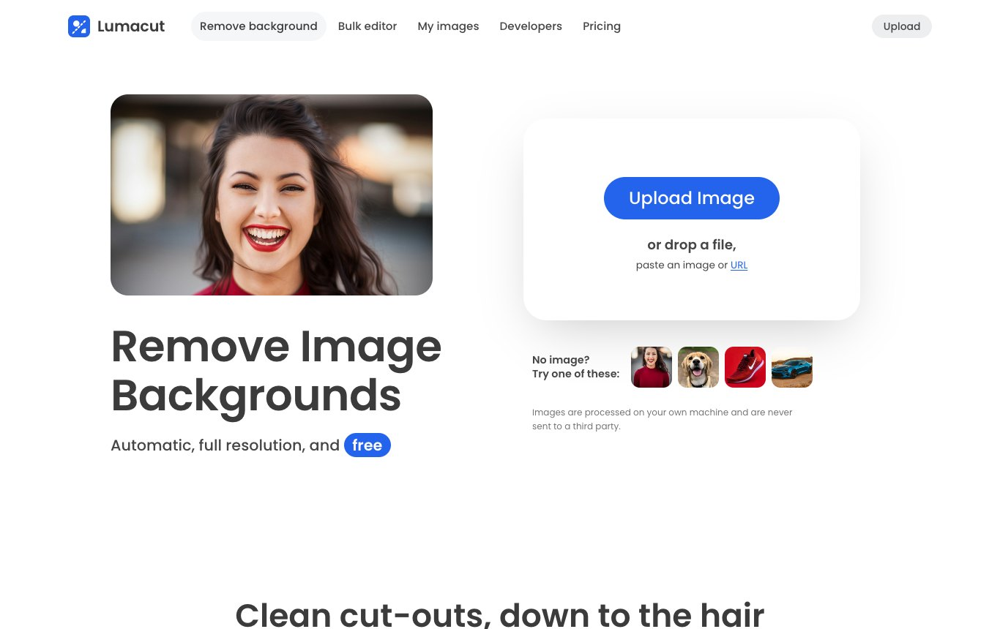
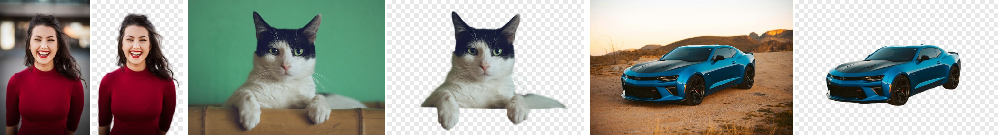

# Lumacut

**Free background remover that runs on your own computer.** Drop in a photo and get a clean cut-out — hair, fur and fine edges included — with no account, no credits, no watermark, and no uploading your images to anyone.

**[Try the online demo →](https://ihatesas.github.io/lumacut/)** (runs a lighter model in your browser; [install it](#install) for the best quality)





## Install

You need:

- **Python 3.10–3.13** — [python.org/downloads](https://www.python.org/downloads/) (on Windows, tick “Add python.exe to PATH”)
- **Git** — [git-scm.com/downloads](https://git-scm.com/downloads)
- About **2 GB of disk space** and **8 GB of RAM**
- Best on an **Apple Silicon Mac** or a PC with an **NVIDIA GPU**. Other computers work too, just more slowly.

### macOS / Linux

Open Terminal and run:

```bash
git clone https://github.com/ihateSAS/lumacut.git
cd lumacut
./start.sh
```

### Windows

Open Command Prompt and run:

```bat
git clone https://github.com/ihateSAS/lumacut.git
cd lumacut
start.bat
```

Then open **http://localhost:5173** in your browser.

The first start takes a few minutes: it installs PyTorch into a private `.venv` folder and downloads the two AI models (~830 MB) into `models/`. After that it starts in about 20 seconds. Next time, just run `./start.sh` (or `start.bat`) again from the `lumacut` folder. Stop it with <kbd>Ctrl</kbd>+<kbd>C</kbd>.

### Update

```bash
cd lumacut
git pull
```

If a later version changes `requirements.txt`, delete the `.venv` folder once so it reinstalls.

### Uninstall

Delete the `lumacut` folder. Nothing is installed anywhere else. (Your saved images live in your browser’s site storage; clear them first in **My images → Delete all images** if you like.)

### Troubleshooting

| Problem | Fix |
| --- | --- |
| `./start.sh: Permission denied` | Run `chmod +x start.sh` once, or start it with `sh start.sh`. |
| `Could not create a virtual environment` on Ubuntu/Debian | `sudo apt install python3-venv`, then run `./start.sh` again. |
| “Lumacut needs Python 3.10 to 3.13” | Install a supported Python from python.org and try again. |
| Windows PC with an NVIDIA GPU is slow | Update your NVIDIA driver, delete the `.venv` folder, and run `start.bat` again so it installs the GPU build of PyTorch. |
| Port 5173 is already in use | Start it on another port: `PORT=5180 ./start.sh` (Windows: `set PORT=5180` then `start.bat`). |
| Something went wrong during setup | Delete the `.venv` folder and run the start script again. |

### Sharing with your team

By default the server only accepts connections from your own computer. To let others on your network use it, start it with `HOST=0.0.0.0 ./start.sh` and give them `http://<your-computer's-IP>:5173`. There’s no log-in, so only do this on a network you trust.

### Settings

Environment variables: `PORT` (default 5173), `HOST` (127.0.0.1), `MATTE_SIDE` (1600, the matting resolution — lower is faster), `GPU_CACHE_GB` (4, the GPU memory cache cap).

## How the AI works

| Stage | What happens | Where |
| --- | --- | --- |
| 1. Segmentation | **BiRefNet** (MIT) finds the subject, giving a 1024×1024 probability mask | `server.py` (GPU, ~0.7 s) |
| 2. Matting | A trimap is built from the mask: sure subject, sure background, and an unknown band around the edges. **ViTMatte** (Apache-2.0, trained on Distinctions-646) solves true alpha in the band at up to 1600 px, recovering hair, fur and whiskers | `server.py` (GPU, ~1.3–2 s) |
| 3. Colour clean-up | Blur-fusion foreground estimation removes the old background colour from semi-transparent pixels, so there are no halos | `js/refine.worker.js` |
| Fallback | Without the server (like the online demo), **RMBG-1.4** runs in the browser, and a guided filter snaps its edges to the photo before stage 3 | `js/engine.js` |

Measured on an M5 MacBook with 16 GB of memory: about 2–4 seconds per image, with the server using about 2 GB of memory.

## Features

| Area | What you get |
| --- | --- |
| Input | Upload button, drag & drop anywhere, paste (image or URL), image URL field, sample images |
| AI | BiRefNet + ViTMatte on the local GPU server, or RMBG-1.4 in the browser; colour decontamination; model picker with re-run |
| Result | Original/Removed/Compare views with a drag slider; download as PNG/WebP/JPG at full, half or preview size; copy to clipboard; quick background swatches |
| Editor | Colors and a custom picker, 10 backdrops, your own background photo, blurred original background, erase/restore brush with size and softness, "show original" ghost view, reset to AI result, drop shadow, crop to subject with padding, aspect ratios, undo/redo, zoom and pan, hold to compare |
| My images | Every result from the home page and the bulk editor is saved in your browser (original, mask and edits), with search, sort, multi-select ZIP download or delete, re-editing, a storage readout, and a history limit from 25 to 500 (default 100) |
| Bulk | Many images at once with shared output settings; 2 at a time on the local server; per-image edit and download; download all as a ZIP |
| Developers | `js/sdk.js` exports `removeBackground()`, `getMask()`, `createProject()`, `onStatus()`, with a docs page and a live playground; the server exposes `POST /api/matte` |

## Files

```
index.html          home: upload, workspace, examples, use cases, FAQ
bulk.html           bulk editor
library.html        My images (saved history)
developers.html     SDK docs + playground
pricing.html        pricing (free)
css/styles.css      all styles
js/engine.js        model choice, server/browser segmentation, refinement calls
js/refine.worker.js guided filter (browser fallback) + foreground colour estimation
js/project.js       image + mask + edit state; rendering and export
js/editor.js        full-screen editor
js/app.js           home page logic
js/bulk.js          bulk page logic
js/library.js       My images page logic
js/model-picker.js  shared AI-model picker
js/sdk.js           public SDK
js/common.js        header/footer, input handling, toasts, saved-image storage
server.py           static server + BiRefNet/ViTMatte pipeline (POST /api/matte)
start.sh, start.bat set up .venv from requirements.txt and start the server
assets/samples/     sample photos and their cut-outs
docs/               README images
```

## License

The code is MIT-licensed (see [LICENSE](LICENSE)). BiRefNet is MIT-licensed and ViTMatte is Apache-2.0; BiRefNet ships its own model code (`trust_remote_code`), pinned to a specific revision in `server.py`. RMBG-1.4, the in-browser fallback used by the online demo, is licensed by BRIA AI for **non-commercial** use only.

Sample photos are from [Unsplash](https://unsplash.com) and used under the Unsplash License.
